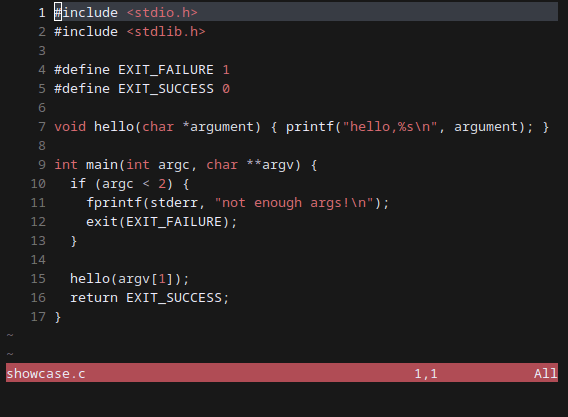

# Accent.nvim, based on accent.vim



## Features

- [x] Light mode
- [x] Random Accent Color
- [x] Custom Accent Color
- [ ] Compatibility with more plugins

## Installation

<details>

Lazy:
```lua

return {
  'svin24/accent.nvim',
  config = function()
    require('accent').setup {
      -- color to use, removing this line uses a random accent color
      accent_color = 'orange',
      --      custom_accent = {
      --        fg = '#FF0000', -- Hex foreground
      --        bg = '#AA0000', -- Hex background
      --        ctermfg = 196, -- Terminal foreground
      --        ctermbg = 124, -- Terminal background
      --      },


      -- makes the background and some text colours darker.
      accent_darken = false,

      -- inverts the colour of the status line text.
      invert_status = false,

      -- sets the accent colour using a hash of the current directory
      auto_cwd_color = false,

      -- stops the background colour being set, which will use the terminal default
      no_bg = true,
    }
    vim.cmd.colorscheme 'accent'
  end,
}
```
</details>

I don't know how to use other package managers that well, if anyone here knows how to use them, then I am happy to add instructions

## Configuration

The priority for colors is the following:

Custom Accent -> Accent Color -> Directory based Color -> Random Color

## Credits

Alligator for the original accent.vim: https://github.com/Alligator/accent.vim
